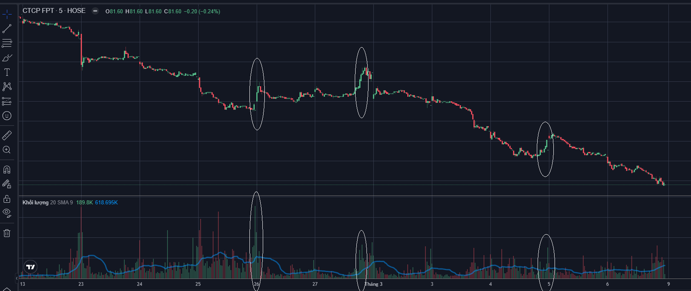

## Tình hình hiện tại

### FPT

Cổ phiếu FPT đang trên đà giảm mạnh. Kể từ sau tín hiệu bán mạnh từ dòng tiền lớn hôm 23/2, giao dịch cổ phiếu này trở nên khác một cách bất thường. Tại mỗi phiên, giá không giảm nhiều, và còn có đợt hồi phục nhẹ vào ngày 27/2, tuy nhiên đây chỉ là đợt phản ứng bình thường trước khi tiếp tục giảm vào các phiên sau đó. Hiện tại chưa có dấu hiệu về dòng tiền lớn tham gia thị trường, giá của cổ phiếu đang chủ yếu dẫn dắt bởi các nhóm nhà đầu tư nhỏ hơn, thể hiện ở tín hiệu khối lượng giao dịch tăng mạnh so với thời kỳ trước cú sốc 23/2, và giá liên tục giảm. Thông tin rút ra từ các phản ứng của nhà đầu tư cá nhân ở đây là gì???



Nhìn vào thông tin khối lượng chứng khoán trong 3 đợt hồi phục, phản ứng tự nhiên trong xu hướng giảm, ta nhận thấy có sự yếu dần trong việc hấp thụ cung cầu ở các lần phản ứng. Lần đầu tiên với khối lượng rất cao so với các khối lượng xung quanh, lần thứ 2 ít hơn lần thứ nhất, tuy nhiên khối lượng vẫn khác biệt so với các khối lượng xung quanh. Tuy nhiên đến lần thứ 3, khối lượng của đợt hồi phục này rất yếu, gần giống như các mốc xung quanh. Các kết luận ở đây là gì?

- Nhà đầu tư tham gia ít hơn vào các đợt hồi phục dẫn đến không có lực cung hấp thụ khối lượng bán ra.
- Trong đợt phản ứng thứ 3, khối lượng giao dịch không nhiều như hai đợt trước nhưng cũng có thể đẩy thị trường lên được, có thể thấy rằng đang có sự khác nhau giữa hành vi hồi phục của giá cổ phiếu theo khối lượng giao dịch. Vào thời điểm đó, không có quá nhiều nhà đầu tư hứng thú với việc cổ phiếu hồi phục, hệ quả sau đó, là giá tiếp tục giảm. Tốc độ giảm có vẻ nhanh hơn so với đợt phản ứng thứ 2. Trong đợt phản ứng thứ 2, mất 3 phiên để giá giảm 6.5%, tuy nhiên trong đợt phản ứng thứ 3, chỉ mất 2 phiên để giảm 5.9% giá trị cổ phiếu.

Tại phiên giao dịch ngày 6/3, có hiện tượng bất thường khi khối lượng giao dịch cuối ngày đột nhiên giảm rất sâu, không như các phiên trước đó. Thường thì khối lượng giao dịch cuối phiên là khối lượng lớn nhất trong timeframe chiều. 

- Có vẻ như đang không có ai đặt lệnh vào cuối phiên này nữa. Dữ liệu trong quá khứ, ở xu hướng giảm cho thấy có vẻ như giá sẽ tiếp tục giảm sâu sau khi có tín hiệu này.

```markdown
Một dấu hiệu bất thường đó là trong 5 phút cuối của phiên giao dịch, khối lượng giao dịch có hiện tượng không tăng so với trước đó, dữ liệu quá khứ cho thấy trong xu hướng giảm, khi có tín hiệu này thì giá sẽ thường giảm tiếp và giảm sâu, phù hợp với nhận định hiện tại về giá của FPT. Có vẻ như đây là tín hiệu mạnh của việc giá sẽ đi tiếp theo một xu hướng mạnh mẽ nào đó tiếp theo, như hiện tại là xu hướng giảm.
```

Kể từ phiên 23/2. khối lượng giao dịch cho thấy mức độ chi phối của nhà đầu tư lớn đang giảm dần, thể hiện ở biên độ ngày càng nhỏ trong khối lượng giao dịch thời gian ngắn. Có thể cho thấy các nhà đầu tư lớn đã tạo xong xu hướng và để cho thị trường tự quyết định chính nó.

### TPB

Các phiên hiện tại giao dịch khá bình thường, không có bất thường gì về giá cũng như không có sự tham gia nhiều của các dòng tiền lớn. Nền giá của cổ phiếu đang khá ổn định nhưng chịu áp lực bán chung từ thị trường nên giá giảm nhiều và về mốc 16.85. Ngưỡng hỗ trợ kỹ thuật tiếp theo là 16.6, nếu như vẫn tiếp tục có áp lực từ thị trường thì giá có thể về mốc này rồi sau đó bật lên. Hiện tại giá của TPB vẫn đang ổn định và tốt, không có sự can thiệp nhiều từ dòng tiền lớn.

### MSN

Giá về ngưỡng hỗ trợ kỹ thuật. Gần cuối phiên có sự can thiệp của một khối lượng lớn cổ phiếu bị bán ra dẫn đến giá sập mạnh. Khả năng lớn vào tuần tiếp theo giá MSN sẽ tiếp tục giảm nếu như còn áp lực bán từ thị trường, tìm thời điểm phản ứng tự nhiên để bán, tạm thời thoát khỏi MSN, tuy nhiên mục tiêu vẫn không đổi, hold MSN trong vòng 1-2 năm tới.

