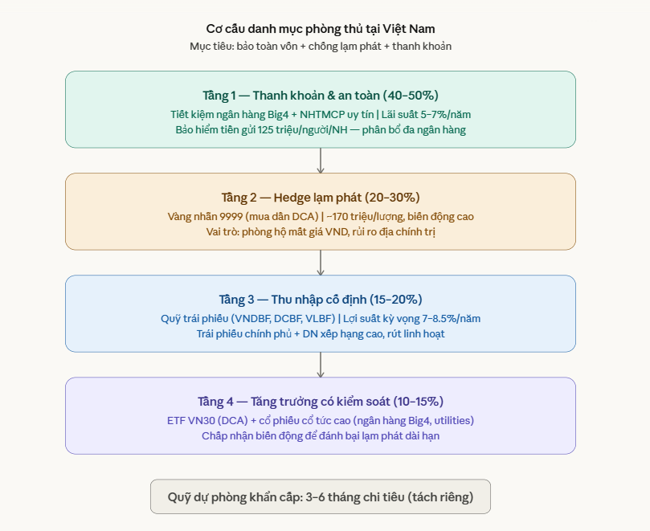

# Bản chất của việc đàu tư cổ phiếu

Là sử đồng thuận về mặt giá cả của người mua và người bán. Nhiều người cùng mua và bán tạo nên mức giá được đồng thuận trên thị trường. Giá tăng vì có số lượng người mua tin rằng người ta nhận được nhiều lợi ích hơn nữa và sẽ khiến giá cao lên.

# mẫu danh mục đầu tư dựa trên dữ liệu lịch sử về risk và lợi nhuận

Danh mục đầu tư bao gồm nhiều loại tài sản khác nhau với các mức rủi ro khác nhau. Có thể nhắc đến như tiền gửi, trái phiếu, cổ phiếu, crypto. Xác định mức độ rủi ro và phân bổ tài sản để có lợi suất tổng thể cao đi kèm với rủi ro thấp là chiến lược thực tế khả dụng đối với các nhà đầu tư hiện nay.
Các cấu phần để xác định một danh mục đầu tư bao gồm:

- Loại tài sản
- Tỷ trọng của nó trong tổng tài sản
- Mức lợi suất tổng thể của danh mục
- Mức độ rủi ro của danh mục đó được tính bằng số năm thua lỗ trên tổng số năm đầu tư.

Hiện tại tôi đang có:

- Tiền gửi
- Vàng
- Chứng khoán

Một số tài sản có thể thêm vào danh mục đầu tư như:

- Trái phiếu doanh nghiệp có lãi suất cao hơn việc gửi ngân hàng.
- Tài sản vật chất như nhà ở...

Trong từng khoảng thời gian lớn, việc thay đổi lớn trên thị trường sẽ khiến nhà đầu tư cơ cấu lại danh mục của mình để khiến nó trở nên khỏe mạnh và bền vững hơn. Trong khoảng thời gian thu lời trên thị trường, danh mục cần được mở rộng với cơ cấu tài sản rủi ro cao hơn để đảm bảo rủi ro bỏ lỡ cơ hội. Khi thị trường đang trong giai đoạn rủi ro, cơ cấu danh mục cần phải được tái cơ cấu để đáp ứng thanh khoản và bảo toàn sự an toàn cho tài sản.

Để đảm bảo tính thanh khoản, các sản phẩm tiền gửi hoặc trái phiếu ngắn hạn mang lại lợi suất tương đối tốt, trong khi trái phiếu với các kỳ hạn dài hơn và tiền gửi ngân hàng không có sự thanh khoản ngay lập tức nhưng cho lợi suất cao hơn.

Ví dụ về cơ cấu danh mục tài sản cho mục đích phòng thủ:

Như vậy thì bài toán quản lý tài sản không chỉ là đầu tư cổ phiếu, mà còn là xây dựng cấu trúc danh mục tài sản an toàn, đảm bảo rủi ro về lâu dài. Sau khi cấu trúc, cần đánh giá lợi suất định kỳ tài sản cá nhân để xác định mức độ sinh lời của tài sản và cơ cấu danh mục để xem danh mục có lành mạnh không, mức độ rủi ro như thế nào để cơ cấu lại một cách kịp thời. Ngoài ra việc quản lý quỹ dự phòng khẩn cấp cũng là vấn đề khi cần xác định rõ vai trò của nó trong danh mục và tác dụng thực tế là như thế nào.

# Phí càn phải trả cho các quỹ đầu tư.

# Liệu có thể trading bằng bot được không?

Mỗi lý thuyết chứng khoán đều đúng, nó đều hướng đến một mục tiêu lợi nhuận ở các khoảng thời gian khác nhau, có cơ sở lý thuyết rõ ràng và thể hiện một khía cạnh khác nhau trong thị trường chứng khoán. Điểm mấu chốt ở đây là về mặt thời gian. Phân tích dài hạn, lướt sóng, cơ bản đều cần thời gian để các mẫu hình hay giá đi hết chu kỳ của nó. 