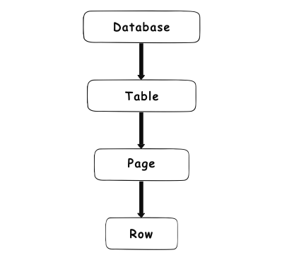

Locking in SQL Server

Là một cơ chế thiết yếu trong quá trình thực hiện các transaction trong sql. Nó được thiết kết để SQL có thể làm việc một cách liền mạch trong môi trường có nhiều user. Locking là một cách để sql server quản trị nhiều transaction đồng thời. Locks là một kiến trúc trong bộ nhớ, có owners, types và được mã hóa của tài nguyên mà nó cần phải bảo vệ. Một lock là một cấu trúc nhớ có dung lượng 96 bytes.

Để hiểu sâu hơn về locking trong SQL server, ta cần phải hiểu nguyên nhân và locking được thiết kế ra trong một database. Như mọi transaction khác, lock cũng buộc nó phải pass qua giao thức kiểm định ACID

- Atomicity – requires that a transaction that involves two or more discrete parts of information must commit all parts or none
- Consistency – requires that a transaction must create a valid state of new data, or it must roll back all data to the state that existed before the transaction was executed
- Isolation – requires that a transaction that is still running and did not commit all data yet, must stay isolated from all other transactions
- Durability – requires that committed data must be stored using method that will preserve all data in correct state and available to a user, even in case of a failure

Locking là mọt phần thiết yếu trong yêu cầu của một cơ sở dữ liệu. Nó được sinh ra để khóa các object có tương tác với giao dịch liên quan. Trong khi các objects bị khóa, SQL server sẽ không cho phép các transaction khác thực hiện bất kỳ một thay đổi nào trên object được chỉ định bằng thao tác được gọi là "imposed lock". Một khi quá trình khóa được giải phóng bởi transaction liên quan đã commit hoặc rollback, các transaction khác mới có thể được phép thực hiện các thay đổi của mình.

Với bối cảnh là SQL server, nó có nghĩa là một transaction thực hiện việc khóa một object, tất cả các transaction khác yêu cầu quyền truy cập vào object nói trên đều bị chặn có đến khi việc khóa kết thúc. Việc đợi này được định nghĩa bằng các loại đợi khác nhau.

SQL server locks có thể được phân loại thông qua chế độ (modes) và độ chia (granularity)

Lock modes

Có nhiều loại lock khác nhau bao gồm:

- Exclusive (X)
- Shared (S)
- Update (U)
- Intent (I)
- Schema (Sch)
- Bulk update (BU)

Exclusive lock (X)

Loại lock này, khi được áp dụng, sẽ đảm bảo rằng page hoặc dòng dữ liệu bị lock đó sẽ được dành riêng cho transaction thực hiện đó. Hay nói cách khác, transaction và lock có mối quan hệ 1-1.

X-model được áp dụng khi nó muốn thay đổi một page hoặc 1 row data. Ở đây là các câu lệnh DML như DELETE, INSERT, UPDATE. Một X-model có thể thực hiện việc khóa trên 1 page hoặc 1 row dữ liệu chỉ khi nó (đang) không chia sẻ đối tượng lock với một tiến trình lock khác. Nó cũng có nhĩa là một khi 1 đối tượng bị lock, không có tiến trình nào khác có thể lock chính tiến trình lock trước đó.

S-model - Loại lock này khi được áp dụng sẽ giữ lại khả năng đọc dữ liệu của đối tượng. Có nghĩa là bất kỳ một transaction khác đều sẽ bị ngăn chặn trong khi việc lock đang còn hiệu lực. Mặc dù vậy, một S-mode có thể được áp đặt trên nhiều tiến trình khác nhau ở cùng một thời gian và trên cùng một đối tượng. Bằng cách này, việc đọc dữ liệu vẫn có thể được cho phép vì nó không thực hiện bất kỳ thay đổi nào trên dữ liệu. Thêm vòa đó, S-mode có thể khả dụng với việc write dữ liệu, nhưng không có câu lệnh DDL nào được phép.

U-mode - tương tự với X-mode nhưng được thiết kế một cách linh hoạt hơn. Một U-mode có thể được áp đặt lên một record khi có một S-mode áp dụng lên đó tượng đó.

I-mode - được sử dụng bởi một transaction để thông báo với các transaction khác về chủ đích yêu cầu một tiến trình lock. Mục đích của nó là đảm bảo chắc chắn quá trình thay đổi dữ liệu được diễn ra bằng việc ngăn chặn tất cả các yêu cầu lock của các transaction lên đối tượng được chỉ định. Trong thực tế, khi một transaction muốn yêu cầu một tiến trình lock lên một row, nó cũng thực hiện một yêu cầu intent lock lên một bảng, tức là trên một đối tượng lớn hơn. Bằng việc thực hiện yêu cầu này, nó đảm bảo tất cả các transaction khác không thực hiện một yêu cầu lock lên chính table đó.

Đây là một loại lock quan trọng trong cơ chế hoạt động của SQL server. Nó sẽ kiểm tra các intent locks trên các table để xem nó có khả năng nhận các yêu cầu lock từ các transaction mà vẫn đảm bảo an toàn. 

Regular intent locks:

Intent exclusive (IX)

Khi một intent exclusive lock (IX) được yêu cầu, nó chỉ ra cho SQL Server rằng giao dịch này có khả năng thay đổi một số tài nguyên trong các cấp đối tượng nhỏ hơn bằng việc yêu cầu một  exclusive (X) locks trên chính tài nguyên có thay đổi.

Intent shared (IS):

Khi một Intent shared (IS) lock được yêu cầu, nó chỉ ra cho SQL Server rằng các transaction có tiềm năng đọc một số tài nguyên trong cấp đối tượng nhỏ hơn bằng việc cung cấp một shared locks (S) trên chính resource nhỏ hơn trên cấu trúc phân cấp.

Intent update (IU)

Khi một Intent shared lọc (IS) được yêu cầu, nó chỉ ra cho SQL Server rằng transaction có tiềm năng đọc một số tài nguyên trong các đối tượng nhỏ hơn bằng việc yêu cầu một shared locks (S) trên cấu trúc nhỏ hơn đó. Intent update lock (IU) có thể yêu cầu việc khóa diễn ra chỉ ở cấp độ page, ở cấp độ này nó chuyển hóa thành một (IX) lock.

Conversion locks:

Shared with intent exclusive (SIX)

Khi được yêu cầu, loại lock này chỉ ra rằng transaction có ý định đọc toàn bộ tài nguyên tại các cấu trúc phân cấp nhỏ hơn, và thêm vào đó, nó tạo ra các shared lọc trên tất cả tài nguyên này, tuy nhiên chúng có thể sẽ chỉ thay đổi một phần trong toàn bộ tài nguyên, không phải toàn bộ tài nguyên đó. Do vậy, nó sẽ thành lập một (IX) lọc trên các tài nguyên bị thay đổi trực tiếp. Trong thực tế, nó có nghĩa là một khi transaction thành lập một SIX lock trên một bảng, nó sẽ yêu cầu một IX lock trên page bị thay đổi, và một X lock trên dòng bị thay đổi.

Chỉ một chia sẻ với một SIX lock có thể tại ra một bảng tại cùng một thời điểm, và nó sẽ khóa tất cả các transaction khác để thực hiện việc update. Nhưng nó thậm chí sẽ không cho các transaction khác này có thể đọc được tài nguyên trong cấu trúc phân cấp nhỏ hơn này. Trong trường hợp này, các transaction khác chỉ có thể tạo ra một IS lock trên bảng.

Shared with intent update (SIU)

Loại này có phần giống với sự kết hợp của (S) và (IU) locks. 

Cấu trúc phân cấp lock:

Do được thao tác trên các đối tượng, nó được sắp xếp theo cấu trúc phân cấp sau:

