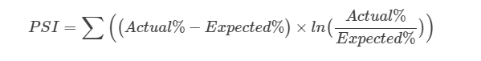
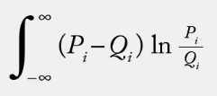

## Population Stability Index (PSI)

PSI: Là một chỉ tiêu tính toán mức độ bất đối xứng của hai phân phối dữ liệu của hai nhóm dữ liệu được thu thập trong các mốc thời gian khác nhau.
Mức độ bất đối xứng này được tập trung vào một con số duy nhất là PSI, thể hiện trên toàn bộ phân phối dữ liệu. Diễn giải thông thường của PSI như sau:

- PSI < 0.1: Không có sự thay đổi trong phân phối.
- PSI < 0.2: Có sự thay đổi nhẹ trong phân phối của các nhóm dữ liệu
- PSI >= 0.2: Có sự thay đổi lớn trong phân phối giữa các nhóm dữ liệu.

## Công thức tính toán:

Trong công thức trên, ta có thể diễn giải như sau:

PSI = SUM(A x Ln(A/E) - E x Ln(A/E))

Đại lượng Ln(A/E) Chỉ ra hướng của sự khác biệt, còn A - E chính là độ lớn của sự chênh lệch. PSI là con số đại diện cho tổng của mức độ và hướng của sự bất đối xứng của dữ liệu. Lưu ý rằng khi PSI = 0, không có nghĩa là phân phối của hai bộ dữ liệu là hoàn toàn giống nhau, nó có thể khác nhau tuy nhiên mức độ sai lệch được bù trừ qua hướng của chênh lệch.

Ngoài ra, công thức tính toán PSI trên một tạp dữ liệu liên tục như sau:

Tuy nhiên, để đơn giản, trong các trường hợp ta có thể chia các biến liên tục thành từng khoảng để áp dụng như biến rời rạc.

PSI có thể áp dụng cho việc kiểm  tra kết quả của phân phối đầu ra của mô hình (trong mô hình phân lớp hoặc hồi quy). PSI cũng có thể sử dụng để kiểm tra phân phối của từng trường dữ liệu trong tập dữ liệu để kiểm tra mức độ suy biến của dữ liệu theo thời gian.

## Các bước để tính PSI

1. Sắp xếp điểm hoặc chia biến thành các category.
2. Chia dữ liệu thành các phần bằng nhau (từ 10-20 phần).
3. Tính phần trăm quan sát so với số lượng tổng thể của mỗi phần.
4. Tính PSI của từng phần
5. Tính PSI của bộ dữ liệu bằng cách cộng các PSI thành phần.

Nhược điểm

Chỉ số PSI cho biết mức độ suy biến của phân phối dữ liệu theo thời gian, tuy nhiên không đánh giá được hướng của suy biến, mức độ phân tán hay các chỉ số cơ bản của thống kê dữ liệu. Để bổ sung cho việc này nhằm nhìn dữ liệu một cách cụ thể hơn, ngoài việc tính toán chỉ số PSI, ta còn cần tính toán các chỉ số thống kê cơ bản của dữ liệu như mean, median, std, skewness, kutosis... để có cái nhìn rõ nhất về dữ liệu.

